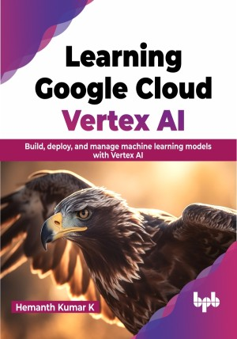

# Learning Google Cloud Vertex AI

Learn how to build an end-to-end data to AI solution on Google Cloud using Vertex AI

This is the repository for [Learning Google Cloud Vertex AI
](https://bpbonline.com/products/learning-google-cloud-vertex-ai?variant=42873766379720),published by BPB Publications.

## About the Book
Google Cloud Vertex AI is a platform for machine learning (ML) offered by Google Cloud, with the objective of making the creation, deployment, and administration of ML models on a large scale easier. If you are seeking a unified and collaborative environment for your ML projects, this book is a valuable resource for you.

This comprehensive guide is designed to help data enthusiasts effectively utilize Google Cloud Platform's Vertex AI for a wide range of machine learning operations. It covers the basics of the Google Cloud Platform, encompassing cloud storage, big query, and IAM. Subsequently, it delves into the specifics of Vertex AI, including AutoML, custom model training, model deployment on endpoints, development of Vertex AI pipelines, and the Explainable AI feature store.

By the time you finish reading this book, you will be able to navigate Vertex AI proficiently, even if you lack prior experience with cloud platforms. With the inclusion of numerous code examples throughout the book, you will be equipped with the necessary skills and confidence to create machine learning solutions using Vertex AI.

## What You Will Learn
•  Learn how to create projects, store data in GCP, and manage access permissions effectively.

•  Discover how AutoML can be utilized for streamlining workflows.

•  Learn how to construct pipelines using TFX (TensorFlow Extended) and Kubeflow components.

•  Gain an overview of the purpose and significance of the Feature Store. 

•  Explore the concept of explainable AI and its role in understanding machine learning models.
